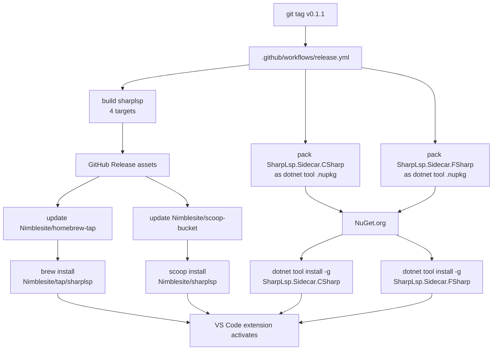
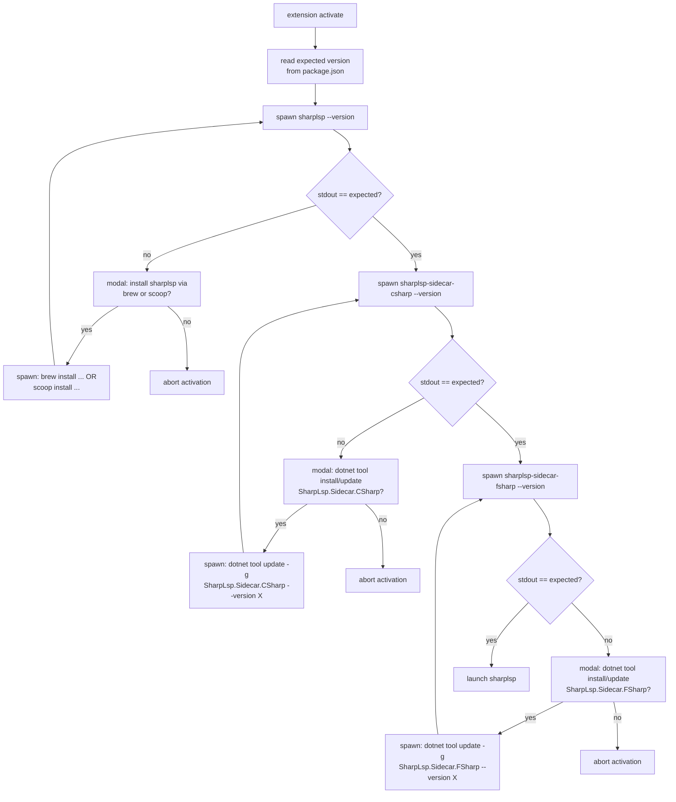

# Distribute SharpLsp via Homebrew, Scoop, and dotnet tool `[BINARY-DEPLOYMENT]`

## Context `[BINARY-CONTEXT]`

SharpLsp currently ships a single tagged GitHub release containing one monolithic archive per platform with `bin/sharplsp` + `sidecar-csharp/` + `sidecar-fsharp/` folders. The VS Code extension downloads that archive and extracts it into `~/.local/` (see [`install.ts`](../../src/editors/vscode/src/install.ts)).

The distribution contract defines three channels:

1. **Rust `sharplsp` binary** — Homebrew (macOS/Linux) and Scoop (Windows), driven by GitHub release assets.
2. **C# and F# sidecars** — published as global `dotnet tool` packages (`dotnet tool install -g SharpLsp.Sidecar.CSharp` / `.FSharp`).
3. **VS Code and future editor extensions** — on activation, MUST spawn each component with `--version` and compare it with `package.json`; file presence, bundled fallback, and version drift are invalid. A missing or mismatched component MUST trigger one modal prompt, then installation or update through `brew`, `scoop`, or `dotnet tool`. Editor extensions MUST NOT download binaries directly.

## Architecture `[BINARY-ARCHITECTURE]`



## Runtime resolution in the VSIX `[BINARY-RUNTIME]`



Rules:

- Version check is ALWAYS by spawning the binary with `--version` and string matching against the `package.json` version. No file-presence shortcuts, no cached results across sessions.
- The extension is forbidden from downloading binaries directly over HTTPS. The only installation paths are `brew`, `scoop`, and `dotnet tool install`.
- If the package manager itself is missing (no `brew` on macOS, no `scoop` on Windows, no `dotnet` anywhere), show a modal with a link to install the package manager and abort activation.
- Never fall back to a "best effort" older version. Expected version == installed version, byte-for-byte. Mismatch = install/update.

## Required changes `[BINARY-CHANGES]`

### Framework-dependent sidecar tools `[BINARY-SIDECARS]`

`src/sidecars/SharpLsp.Sidecar.CSharp/SharpLsp.Sidecar.CSharp.csproj` `src/sidecars/SharpLsp.Sidecar.FSharp/SharpLsp.Sidecar.FSharp.fsproj`

Changes:

- **Remove `<SelfContained>true</SelfContained>`.** Sidecars ship as framework-dependent dotnet tools. One .nupkg per sidecar, cross-platform. Users install `.NET 10 Runtime` as a prerequisite (checked by the VSIX before prompting — if `dotnet --version` is missing, send the user to dotnet.microsoft.com). Roslyn's `BuildHost-netcore` DLLs and FCS's runtime dependencies ship inside the tool package's `tools/<tfm>/any/` directory and are resolved at runtime relative to the tool entry point.
- Add `<PackAsTool>true</PackAsTool>`
- Add `<ToolCommandName>sharplsp-sidecar-csharp</ToolCommandName>` / `sharplsp-sidecar-fsharp`
- Add `<PackageId>SharpLsp.Sidecar.CSharp</PackageId>` / `SharpLsp.Sidecar.FSharp`
- Add `<Authors>`, `<Description>`, `<PackageLicenseExpression>`, `<RepositoryUrl>`, `<PackageReadmeFile>`
- `<PackageVersion>` injected at pack time from the git tag (`dotnet pack -p:PackageVersion=$VERSION`)
- Add `--version` flag handling in `Program.cs` / `Program.fs` that prints `sharplsp-sidecar-csharp <version>` (read from the assembly's `InformationalVersion` attribute, stamped at pack time) so the extension can version-check by spawning the installed tool.

**Risk: will MSBuildWorkspace still work?** `MSBuildWorkspace` spawns `BuildHost-netcore.dll` as a child process using a path resolved relative to the Roslyn assembly location. Inside a dotnet global tool, the Roslyn assemblies are unpacked to `~/.dotnet/tools/.store/sharplsp.sidecar.csharp/<version>/sharplsp.sidecar.csharp/<version>/tools/net10.0/any/` and `BuildHost-netcore.dll` is in the same folder as the Roslyn package dependencies (dotnet pack copies all `PackageReference` content into the tool output). This should Just Work — but verification step 1 MUST confirm it against a real `.csproj` before merging. If it genuinely breaks (e.g. FCS using `Assembly.Location` returning a path that no longer contains FSharp.Core), the fix is to flip `<RollForward>LatestMajor</RollForward>` and ensure `<CopyLocalLockFileAssemblies>true</CopyLocalLockFileAssemblies>` so every transitive dep lands next to the tool DLL. Still dotnet tool. No self-contained.

### Rust binary version contract `[BINARY-RUST]`

No changes needed in the Rust source. Already verified at [`install.ts`](../../src/editors/vscode/src/install.ts).

### Release workflow `[BINARY-RELEASE]`

Replace the current monolithic archive job with:

**Job A: `build-sharplsp`** (matrix: 4 targets)
- Build `cargo build --release --target <target>`
- Package single binary as `sharplsp-<tag>-<target>.{tar.gz,zip}` (no sidecar dirs — just the binary, like dart_mutant)
- Upload artifact

**Job B: `pack-sidecars`** (single ubuntu job — framework-dependent, no RID matrix)
- `dotnet pack src/sidecars/SharpLsp.Sidecar.CSharp -p:PackageVersion=<version> -c Release -o nupkgs` → one cross-platform `.nupkg`
- Same for `SharpLsp.Sidecar.FSharp`
- Total: 2 nupkgs per release
- Upload nupkg artifacts

**Job C: `release`** (needs [A, B])
- `gh release create` with all tar.gz/zip assets (sharplsp only)

**Job D: `publish-nuget`** (needs [B])
- `dotnet nuget push *.nupkg --api-key ${{ secrets.NUGET_API_KEY }} --source https://api.nuget.org/v3/index.json`

**Job E: `update-homebrew`** (needs [release])
- Checkout `Nimblesite/homebrew-tap` with `BREW_SCOOP_PAT`
- Download macOS arm64 + macOS x64 + linux x64 tar.gz assets, sha256 each
- Generate `Formula/sharplsp.rb` with `on_macos {on_arm / on_intel}` and `on_linux { on_intel }` blocks, one url+sha256 per block
- `def install; bin.install "sharplsp"; end`
- `test do; assert_match "sharplsp", shell_output("#{bin}/sharplsp --version"); end`
- Commit and push

**Job F: `update-scoop`** (needs [release])
- Checkout `Nimblesite/scoop-bucket` with `BREW_SCOOP_PAT`
- Download win x64 zip, sha256 it
- Write `bucket/sharplsp.json` with `architecture."64bit".{url,hash,bin}`, `checkver.github`, `autoupdate.architecture."64bit".url` template
- Commit and push

### VS Code installation flow `[BINARY-VSCODE]`

Replace `ensureBinaries` and the entire download path in [`install.ts`](../../src/editors/vscode/src/install.ts) with a verify-then-install-via-package-manager layer.

**Version check (mandatory, always via `--version`):**

```ts
function getVersion(command: string): string | undefined {
    // spawnSync command --version, parse first line "<name> <semver>"
    // return semver or undefined on any failure (not found, crash, parse)
}
```

This is called for all three: `sharplsp`, `sharplsp-sidecar-csharp`, `sharplsp-sidecar-fsharp`. No file-existence checks, no fallbacks.

**Package-manager-driven install (the only install path):**

```ts
// Per-binary install/update command keyed by platform.
// No HTTPS downloads, no tarball extraction, no ~/.local staging.
const INSTALL_COMMANDS = {
    "sharplsp": {
        darwin: ["brew", "install", "Nimblesite/tap/sharplsp"],
        linux:  ["brew", "install", "Nimblesite/tap/sharplsp"],
        win32:  ["scoop", "install", "Nimblesite/sharplsp"],
    },
    "sharplsp-sidecar-csharp": {
        all: ["dotnet", "tool", "update", "-g", "SharpLsp.Sidecar.CSharp",
              "--version", EXPECTED],
    },
    "sharplsp-sidecar-fsharp": {
        all: ["dotnet", "tool", "update", "-g", "SharpLsp.Sidecar.FSharp",
              "--version", EXPECTED],
    },
};
```

- `update` (not `install`) is used so the same command works for both first install and version bump. `dotnet tool update -g --version X` installs if absent and re-pins if present.
- For `sharplsp` on Scoop, version pinning uses `scoop install sharplsp@X` if the bucket manifest supports it, otherwise `scoop update sharplsp`.

**Flow for each binary:**

1. `getVersion(binary)` → compare to `expectedVersion()`
2. If match: use it, done.
3. If mismatch: show modal with OK/Cancel — "SharpLsp needs to install `<binary>` at version `<X>`. Run `<command>`?"
4. OK → spawn the command, stream stdout/stderr to an Output Channel so the user sees progress. On exit, re-run step 1.
5. Cancel → throw, activation aborts.

**Preflight — package manager presence:**

Before running any install command, run `getVersion("brew")` / `getVersion("scoop")` / `getVersion("dotnet")`. If the required package manager is missing, show a modal with a link to the install page and abort. Do not offer to install package managers automatically.

**Deletions:**

- `downloadAndInstall`, `downloadToFile`, `extractTarGz`, `platformRid`, `bundledBinaryPath`, and the whole GitHub-release HTTPS path.
- The `bin/` VSIX bundling path and the `~/.local/lib/sharplsp/` staging from both the Makefile `install` target and `.github/workflows/ci-vsix.yml` (recent commits `c6f29f0` and `e1dd2ca` become partially obsolete).

**Forbidden patterns (encoded as lint / code review):**

- `https.get(...)` or `fetch(...)` for binary downloads
- Any path that writes executables into `~/.local/`, `extensionPath/bin/`, or a temp dir with intent to execute
- Any "skip version check if binary exists" shortcut

### Makefile installation targets `[BINARY-MAKEFILE]`

`tools/make/main.mk:584-600` — the install targets currently stage sharplsp + sidecars into `$PREFIX`. Replace with:

- `install-rust`: just copies `sharplsp` to `$PREFIX/bin` (for local dev)
- `install-sidecars`: runs `dotnet tool install -g` from locally packed nupkgs so contributors can test the tool install flow end-to-end
- Drop `~/.local/lib/sharplsp/` entirely. Sidecars now live wherever `dotnet tool` puts them (`~/.dotnet/tools` on macOS/Linux, `%USERPROFILE%\.dotnet\tools` on Windows).

### Canonical documentation `[BINARY-DOCS]`

[`DISTRIBUTION-SPEC.md`](DISTRIBUTION-SPEC.md) is the canonical distribution contract; [`DISTRIBUTION-PLAN.md`](../plans/DISTRIBUTION-PLAN.md) tracks implementation. `SHARPLSP-SPEC.md` links to the canonical contract rather than duplicating it.

## Critical files `[BINARY-FILES]`

- [`.github/workflows/release.yml`](../../.github/workflows/release.yml) — rewrite
- [`src/editors/vscode/src/install.ts`](../../src/editors/vscode/src/install.ts) — replace the download path
- [`src/sidecars/SharpLsp.Sidecar.CSharp/SharpLsp.Sidecar.CSharp.csproj`](../../src/sidecars/SharpLsp.Sidecar.CSharp/SharpLsp.Sidecar.CSharp.csproj) — add `PackAsTool`
- [`src/sidecars/SharpLsp.Sidecar.FSharp/SharpLsp.Sidecar.FSharp.fsproj`](../../src/sidecars/SharpLsp.Sidecar.FSharp/SharpLsp.Sidecar.FSharp.fsproj) — add `PackAsTool`
- [`src/sidecars/SharpLsp.Sidecar.CSharp/Program.cs`](../../src/sidecars/SharpLsp.Sidecar.CSharp/Program.cs) — add `--version`
- [`src/sidecars/SharpLsp.Sidecar.FSharp/Program.fs`](../../src/sidecars/SharpLsp.Sidecar.FSharp/Program.fs) — add `--version`
- [`Makefile`](../../Makefile) — simplify `install` target
- `docs/specs/DISTRIBUTION-SPEC.md` — new
- `docs/plans/DISTRIBUTION-PLAN.md` — new

## External prerequisites `[BINARY-PREREQUISITES]`

These must exist before the release workflow will succeed. Create them before merging the changes:

- GitHub repo `Nimblesite/homebrew-tap` (empty, default branch `main`)
- GitHub repo `Nimblesite/scoop-bucket` (empty, default branch `main`)
- PAT with `contents:write` on both repos → add as `BREW_SCOOP_PAT` secret on `Nimblesite/SharpLsp`
- NuGet.org account + API key with push rights to `SharpLsp.Sidecar.*` → add as `NUGET_API_KEY` secret
- Reserve package IDs `SharpLsp.Sidecar.CSharp` and `SharpLsp.Sidecar.FSharp` on nuget.org via a manual 0.0.1-preview push, to prevent squatting

## Verification `[BINARY-VERIFY]`

1. **Local dry-run of sidecar packaging**
   ```
   dotnet pack src/sidecars/SharpLsp.Sidecar.CSharp -p:PackageVersion=0.1.1 -o /tmp/nupkgs
   dotnet tool install -g --add-source /tmp/nupkgs SharpLsp.Sidecar.CSharp
   sharplsp-sidecar-csharp --version   # must print "sharplsp-sidecar-csharp 0.1.1"
   ```
   Confirms `PackAsTool` and the framework-dependent dependency layout. Failure blocks the dotnet-tool channel.

2. **VSIX verification path**
   - Build VSIX locally with version `0.1.1`
   - Install sidecars at `0.1.0` and `sharplsp` at `0.1.1`
   - Activate extension in a fresh VS Code window
   - Expect: activation fails fast with a modal showing the exact `dotnet tool update -g SharpLsp.Sidecar.CSharp --version 0.1.1` command
   - Install matching versions, reactivate — expect clean startup

3. **Tag-driven end-to-end**
   - Push tag `v0.1.1-rc1` to a test fork
   - Observe: `release` workflow succeeds, GitHub release created, `homebrew-tap` and `scoop-bucket` forks receive commits, nupkgs appear on nuget.org
   - On a clean macOS VM: `brew install Nimblesite/tap/sharplsp` + both `dotnet tool install` commands → VS Code extension activates cleanly
   - On a clean Windows VM: same via scoop

4. **CI smoke test**
   - Add a job to `ci.yml` that runs `dotnet pack` on both sidecars (without publishing) on every PR, so packaging regressions are caught before tag time.
