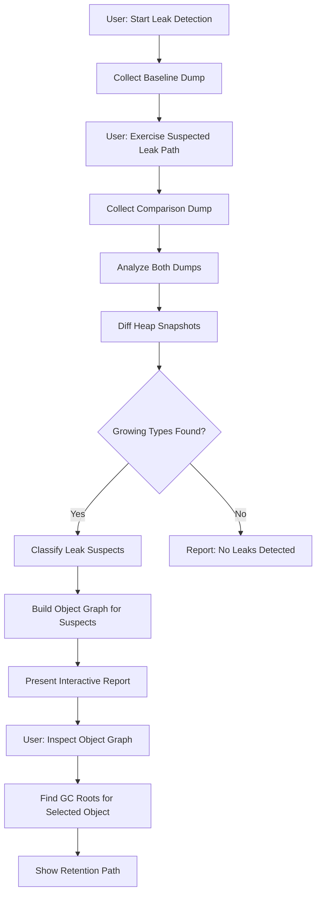
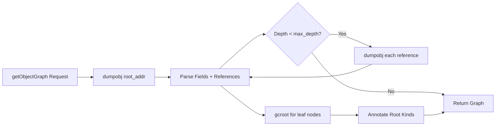

# [PROFILER-INTEGRATION] Profiler Integration Specification

**Parent:** [SHARPLSP-SPEC.md](SHARPLSP-SPEC.md)

## [PROFILER-OVERVIEW] Overview

SharpLsp exposes `dotnet-trace`, `dotnet-counters`, and `dotnet-dump` through LSP custom requests and editor UI.

**Reference:** [dotnet-trace documentation](https://learn.microsoft.com/en-us/dotnet/core/diagnostics/dotnet-trace)

## [PROFILER-TOOLS] Diagnostic Tools

### [PROFILER-TOOLS-TRACE] dotnet-trace

Collects performance traces from running .NET processes using EventPipe. Produces `.nettrace` files convertible to Chromium/SpeedScope formats for visualization.

| Capability | CLI equivalent |
|---|---|
| List processes | Native process table |
| Collect trace | `dotnet-trace collect -p <pid>` |
| Stop trace | Ctrl+C equivalent |
| Convert trace | `dotnet-trace convert` to `.speedscope.json` or Chromium |

### [PROFILER-TOOLS-COUNTERS] dotnet-counters

Real-time monitoring of .NET runtime performance counters (GC, CPU, exceptions, thread pool).

| Capability | CLI equivalent |
|---|---|
| List processes | `dotnet-counters ps` |
| Monitor counters | `dotnet-counters monitor -p <pid>` |
| Collect counters | `dotnet-counters collect -p <pid>` to CSV/JSON |

### [PROFILER-TOOLS-DUMP] dotnet-dump

Captures and analyzes process dumps for memory leak investigation without a native debugger.

| Capability | CLI equivalent |
|---|---|
| Collect dump | `dotnet-dump collect -p <pid>` |
| Analyze dump | `dotnet-dump analyze <file>` |
| Heap stats | `dumpheap -stat` |
| GC roots | `gcroot <addr>` |
| Object references | `dumpobj <addr>` |

## [PROFILER-ARCHITECTURE] Architecture

Implementations: [handlers.rs](../../src/sharplsp/src/profiler/handlers.rs), [session.rs](../../src/sharplsp/src/profiler/session.rs), [object_graph.rs](../../src/sharplsp/src/profiler/object_graph.rs), [profiler.ts](../../src/editors/vscode/src/profiler.ts), and the [full-stack profiler tests](../../src/sharplsp/tests/e2e_modules/profiler_full_stack.rs).

### [PROFILER-ARCHITECTURE-PLACEMENT] Component Placement

The Rust host spawns the diagnostic CLIs and owns discovery, session lifecycle, output parsing, and editor streaming; no sidecar or workspace is involved.

### [PROFILER-ARCHITECTURE-HOST] Rust Host Ownership

Profiler sessions MUST survive a sidecar crash and MUST be cleaned up when the LSP host shuts down.

### [PROFILER-ARCHITECTURE-DISCOVERY] Tool Discovery

On startup (lazy, first use), the host locates diagnostic tools:

| Step | Action |
|------|--------|
| 1 | Check `PATH` for `dotnet-trace`, `dotnet-counters`, and `dotnet-dump` |
| 2 | Check `<home>/.dotnet/tools` roots derived from `DOTNET_CLI_HOME`, `HOME`, and `USERPROFILE` on Windows |
| 3 | If missing, return an error containing the corresponding `dotnet tool install -g <tool>` command |

## [PROFILER-PROTOCOL] LSP Custom Requests

All profiler requests use the `sharplsp/` namespace.

### [PROFILER-PROCESS-LIST] Process Discovery and Termination

**Method:** `sharplsp/profiler/listProcesses`

**Params:**
```typescript
interface ListProcessesParams {}
```

**Result:**
```typescript
interface DotNetProcess {
  pid: number;
  name: string;
  command_line: string;
  /** Shared-framework version or target framework; null when unknown. Always present. */
  runtime_version: string | null;
}

type ListProcessesResult = DotNetProcess[];
```

The host enumerates the native process table through `ps` on Unix and `sysinfo` on Windows. It returns only `dotnet` host processes and apphosts whose output directory contains a `*.runtimeconfig.json`, sorted case-insensitively by name and then by PID.

**Method:** `sharplsp/profiler/killProcess`

```typescript
interface KillProcessParams {
  pid: number;
}

interface KillProcessResult {
  killed: true;
  pid: number;
}
```

The host MUST re-enumerate processes and refuse a PID that is not currently a .NET process. A valid target is forcibly terminated with `SIGKILL` on Unix or `taskkill /F` on Windows; a missing or non-.NET PID returns an error without terminating any process.

### [PROFILER-TRACE] Trace Session

**Method:** `sharplsp/profiler/startTrace`

**Params:**
```typescript
interface StartTraceParams {
  pid: number;
  /** EventPipe profile: "cpu-sampling", "gc-verbose", "gc-collect", or custom provider string */
  profile?: string;
  /** Output format: "nettrace" | "speedscope" | "chromium". Default: "speedscope" */
  format?: string;
  /** Max duration in seconds. 0 = unlimited. Default: 30 */
  duration?: number;
  /** Output file path. Auto-generated if omitted */
  output_path?: string;
}
```

**Result:**
```typescript
interface StartTraceResult {
  session_id: string;
  output_path: string;
}
```

**Method:** `sharplsp/profiler/stopTrace`

**Params:**
```typescript
interface StopTraceParams {
  session_id: string;
}
```

**Result:**
```typescript
interface StopTraceResult {
  output_path: string;
  file_size_bytes: number;
  duration_ms: number;
}
```

#### [PROFILER-TRACE-CONVERSION] Trace File Conversion

A `.nettrace` file MUST be converted to SpeedScope or Chromium JSON before visualization. The conversion request accepts any trace file on disk and does not require a live session.

**Method:** `sharplsp/profiler/convertTrace`

**Params:**
```typescript
interface ConvertTraceParams {
  /** Absolute path to a `.nettrace` file. */
  input_path: string;
  /** Output format: "speedscope" (default) or "chromium". */
  format?: "speedscope" | "chromium";
}
```

**Result:**
```typescript
interface ConvertTraceResult {
  /** Path to the converted file — always a sibling of input_path. */
  output_path: string;
  /** Size of the converted file in bytes. */
  file_size_bytes: number;
}
```

Invokes `dotnet-trace convert <input> --format <format>`. The resulting sibling file is:

| Format | Output sibling |
|--------|----------------|
| `speedscope` | Replace `.nettrace` with `.speedscope.json` |
| `chromium` | Replace `.nettrace` with `.chromium.json` |

`sharplsp/profiler/stopTrace` automatically converts a session that produced data; `convertTrace` handles files with no live session.

### [PROFILER-PROTOCOL-COUNTERS] Counter Monitoring

**Method:** `sharplsp/profiler/startCounters`

**Params:**
```typescript
interface StartCountersParams {
  pid: number;
  /** Counter providers. Default: ["System.Runtime"] */
  providers?: string[];
  /** Refresh interval in seconds. Default: 1 */
  refresh_interval?: number;
}
```

**Result:**
```typescript
interface StartCountersResult {
  session_id: string;
}
```

Counter values streamed via LSP notification:

**Notification:** `sharplsp/profiler/counterUpdate`

```typescript
interface CounterUpdateParams {
  session_id: string;
  counters: CounterValue[];
}

interface CounterValue {
  provider: string;
  name: string;
  display_name: string;
  value: number;
  unit: string;
}
```

**Method:** `sharplsp/profiler/stopCounters`

**Params:**
```typescript
interface StopCountersParams {
  session_id: string;
}
```

### [PROFILER-PROTOCOL-DUMP-COLLECT] Memory Dump Collection

**Method:** `sharplsp/profiler/collectDump`

**Params:**
```typescript
interface CollectDumpParams {
  pid: number;
  /** Dump type. Default: "Heap". */
  dump_type?: "Full" | "Heap" | "Mini";
  /** Output file path. Auto-generated if omitted */
  output_path?: string;
}
```

**Result:**
```typescript
interface CollectDumpResult {
  output_path: string;
  file_size_bytes: number;
}
```

### [PROFILER-PROTOCOL-DUMP-ANALYZE] Memory Dump Analysis

**Method:** `sharplsp/profiler/analyzeHeap`

**Params:**
```typescript
interface AnalyzeHeapParams {
  dump_path: string;
  /** Max rows to return. Default: 50 */
  limit?: number;
  /** Filter by type name substring */
  type_filter?: string;
}
```

**Result:**
```typescript
interface HeapStats {
  total_objects: number;
  total_size_bytes: number;
  types: HeapTypeInfo[];
}

interface HeapTypeInfo {
  type_name: string;
  count: number;
  total_size_bytes: number;
}
```

**Method:** `sharplsp/profiler/findGCRoots`

**Params:**
```typescript
interface FindGCRootsParams {
  dump_path: string;
  /** Object address (hex string) */
  object_address: string;
}
```

**Result:**
```typescript
interface GCRootChain {
  roots: GCRootNode[];
}

interface GCRootNode {
  address: string;
  type_name: string;
  root_kind: string;
}

type FindGCRootsResult = GCRootChain[];
```

## [PROFILER-LEAKS] Memory Leak Tracing Workflow

Memory leak investigation follows a structured workflow exposed through the UI:

### [PROFILER-LEAKS-WORKFLOW] Baseline → Exercise → Compare

| Step | Action | Tool |
|------|--------|------|
| 1 | Collect baseline heap dump | `sharplsp/profiler/collectDump` |
| 2 | Exercise the suspected leak path | (user action) |
| 3 | Collect second heap dump | `sharplsp/profiler/collectDump` |
| 4 | Compare heap stats between dumps | `sharplsp/profiler/analyzeHeap` on both |
| 5 | Identify growing types | Editor diff view of heap stats |
| 6 | Trace GC roots of suspect objects | `sharplsp/profiler/findGCRoots` |

### [PROFILER-LEAKS-COUNTERS] Live Counter Monitoring

Monitor `System.Runtime` counters to detect leaks in real-time:

| Counter | Leak Signal |
|---------|-------------|
| `gc-heap-size` | Monotonically increasing across Gen 2 collections |
| `gen-2-gc-count` | Unusually high frequency |
| `number-of-active-timers` | Growing without bound |
| `threadpool-queue-length` | Sustained growth |

The editor highlights counters that show sustained growth patterns.

### [PROFILER-LEAKS-AUTOMATION] Automated Leak Detection

Automated leak detection compares baseline and comparison heap snapshots.

#### [PROFILER-LEAKS-AUTOMATION-DIFF] Heap Snapshot Diffing

**Method:** `sharplsp/profiler/diffHeapSnapshots`

**Params:**
```typescript
interface DiffHeapSnapshotsParams {
  /** Path to the baseline dump file */
  baseline_dump_path: string;
  /** Path to the comparison dump file */
  comparison_dump_path: string;
  /** Only show types where count or size grew. Default: true */
  growing_only?: boolean;
  /** Minimum growth percentage to report. Default: 10.0 */
  min_growth_percent?: number;
  /** Max rows to return. Default: 50 */
  limit?: number;
}
```

**Result:**
```typescript
interface HeapDiffResult {
  baseline_total_objects: number;
  baseline_total_size_bytes: number;
  comparison_total_objects: number;
  comparison_total_size_bytes: number;
  /** Types sorted by size growth descending */
  diffs: HeapTypeDiff[];
  /** Types flagged as probable leaks */
  leak_suspects: LeakSuspect[];
}

interface HeapTypeDiff {
  type_name: string;
  baseline_count: number;
  comparison_count: number;
  count_delta: number;
  baseline_size_bytes: number;
  comparison_size_bytes: number;
  size_delta_bytes: number;
  growth_percent: number;
}

interface LeakSuspect {
  type_name: string;
  severity: "high" | "medium" | "low";
  reason: string;
  count_delta: number;
  size_delta_bytes: number;
}
```

#### [PROFILER-LEAKS-AUTOMATION-HEURISTICS] Leak Classification Heuristics

SharpLsp classifies leak suspects by combining snapshot diff data with heuristics:

| Severity | Criteria |
|----------|----------|
| **High** | Count grew >100% AND absolute size delta >1MB |
| **Medium** | Count grew >50% AND absolute size delta >100KB |
| **Low** | Count grew >10% AND absolute size delta >10KB |

Additional signals that elevate severity:
- Type is a known leak-prone pattern (event handlers, delegates, `CancellationTokenSource`, timers)
- Type contains `[]` or `List` (collection growth)
- Multiple instantiations of the same growing generic collection type

#### [PROFILER-LEAKS-AUTOMATION-FLOW] Automated Leak Detection Flow



## [PROFILER-GRAPH] Object Graph Visualization

SharpLsp provides an interactive graph of objects and the reference chains retaining them.

### [PROFILER-GRAPH-DATA] Object Graph Data Model

**Method:** `sharplsp/profiler/getObjectGraph`

**Params:**
```typescript
interface GetObjectGraphParams {
  dump_path: string;
  /** Required starting object address (hex). */
  root_address: string;
  /** Max depth to traverse from root. Default: 5 */
  max_depth?: number;
  /** Max nodes to return. Default: 100 */
  max_nodes?: number;
  /** Filter: only include paths through this type name (substring match) */
  type_filter?: string;
}
```

**Result:**
```typescript
interface ObjectGraphResult {
  nodes: ObjectGraphNode[];
  edges: ObjectGraphEdge[];
  /** Summary statistics */
  stats: ObjectGraphStats;
}

interface ObjectGraphNode {
  /** Unique node ID (object address) */
  id: string;
  /** Fully qualified type name */
  type_name: string;
  /** Short display name (last segment of type) */
  display_name: string;
  /** Size in bytes of this single object */
  size_bytes: number;
  /** Total retained size (this object + everything it keeps alive) */
  retained_size_bytes: number;
  /** Number of instances of this type on the heap */
  instance_count: number;
  /** Whether this node is a GC root */
  is_root: boolean;
  /** Root classification when is_root is true. */
  root_kind?: string;
  /** Depth from the query root */
  depth: number;
}

interface ObjectGraphEdge {
  /** Source node ID (the holder) */
  from: string;
  /** Target node ID (the held object) */
  to: string;
  /** Field name or index that holds the reference */
  field_name: string;
  /** Current implementation emits strong references only. */
  reference_kind: "Strong";
}

interface ObjectGraphStats {
  total_nodes_traversed: number;
  total_edges_traversed: number;
  max_depth_reached: number;
  truncated: boolean;
}
```

### [PROFILER-GRAPH-INSPECTION] Object Inspection

**Method:** `sharplsp/profiler/inspectObject`

**Params:**
```typescript
interface InspectObjectParams {
  dump_path: string;
  /** Object address (hex string) */
  object_address: string;
}
```

**Result:**
```typescript
interface ObjectInspection {
  address: string;
  type_name: string;
  size_bytes: number;
  /** Field values for this object */
  fields: ObjectField[];
  /** Generation (0, 1, 2, LOH, POH) */
  generation: string;
  /** Whether the object is pinned */
  is_pinned: boolean;
}

interface ObjectField {
  name: string;
  type_name: string;
  /** Value for primitives/strings, address for reference types */
  value: string;
  /** Whether this field holds a reference to another managed object */
  is_reference: boolean;
  /** If is_reference, the referenced object's address. */
  reference_address?: string;
}
```

### [PROFILER-GRAPH-BUILD] Object Graph Construction

The object graph is assembled from `dotnet-dump analyze` commands:



Commands used per node:
| Command | Purpose |
|---------|---------|
| `dumpobj <addr>` | Get object type, size, field values |
| `gcroot <addr>` | Find what root chain keeps this object alive |
| `dumpheap -mt <MT>` | Count all instances of a specific method table |
| `objsize <addr>` | Calculate retained size (object + transitive refs) |

### [PROFILER-GRAPH-WEBVIEW] Interactive Graph Webview

The object graph renders as an interactive force-directed graph in a VS Code webview panel.

#### [PROFILER-GRAPH-WEBVIEW-LAYOUT] Graph Layout

GC roots and retention chains MUST be connected by labelled reference edges; roots appear before retained objects in the initial layout.

#### [PROFILER-GRAPH-WEBVIEW-FEATURES] Webview Features

| Feature | Description |
|---------|-------------|
| **Force-directed layout** | D3.js physics simulation; nodes repel, edges attract |
| **Color coding** | Red = leak suspect, Orange = large retained size, Blue = GC root, Gray = normal |
| **Node sizing** | Node radius proportional to retained size |
| **Click to expand** | Click a node to fetch and display its children (lazy loading) |
| **Click to inspect** | Right-click a node to see full `dumpobj` output (field values) |
| **Hover tooltip** | Shows type name, size, instance count, retained size |
| **Filter by type** | Text input to filter visible nodes by type name |
| **Collapse subtree** | Double-click to collapse/expand a subtree |
| **Highlight path** | Click a leaf node to highlight the shortest GC root path |
| **Search** | Find objects by type name or address |
| **Export** | Save graph as SVG or PNG |
| **Depth slider** | Control max traversal depth (1–10) |

#### [PROFILER-GRAPH-WEBVIEW-ENCODING] Node Visual Encoding

| Node state | Encoding |
|------------|----------|
| High-severity leak suspect | Red |
| Retained size greater than 1MB | Orange |
| GC root | Blue |
| Normal object | Gray |
| Type growing between snapshots | Warning border |

### [PROFILER-GRAPH-RETENTION] Retention Path View

For any selected object, SharpLsp shows the complete chain from a GC root to that object.

Each node in the retention path shows:
- Type name and size
- The field name on the edge (what reference holds it)
- Instance count (if many instances of same type exist — leak signal)
- Retained size (total memory kept alive through this node)

### [PROFILER-GRAPH-DIFF] Heap Snapshot Diff Visualization

When two snapshots are compared, the diff is shown as an annotated table and a visual graph overlay.

#### [PROFILER-GRAPH-DIFF-TABLE] Diff Table View

The table MUST show type, baseline and current counts, count delta, baseline and current sizes, size delta, and severity.

#### [PROFILER-GRAPH-DIFF-OVERLAY] Diff Graph Overlay

In graph view, nodes from the comparison snapshot are annotated with growth indicators:
- **Pulsing red border** — count grew >100%
- **Growing arrow** — size delta shown on hover
- **New nodes** (not in baseline) appear with dashed border

### [PROFILER-GRAPH-PERFORMANCE] Performance Requirements

| Metric | Target |
|--------|--------|
| Object graph (depth 3, 200 nodes) | <3s |
| Object graph (depth 5, 200 nodes) | <8s |
| Object inspection (`dumpobj`) | <500ms |
| Heap diff (two 50k-type dumps) | <10s |
| Graph webview initial render | <500ms |
| Graph webview node expansion | <1s |
| Retained size calculation | <5s per node |

## [PROFILER-SESSIONS] Session Management

### [PROFILER-SESSIONS-LIFECYCLE] Session Lifecycle

```
Created  ──start──▶  Running  ──stop──▶  Stopped  ──cleanup──▶  Disposed
                        │
                        └──timeout──▶  Stopped
                        └──error──▶  Failed
```

- Each session ID has the form `prof-<unix-epoch-ms>-<process-local-sequence>`
- The Rust host keeps a concurrent session registry containing live child-process state; this registry is state, not memoization
- Maximum concurrent sessions: 5 (configurable via `sharplsp.toml`)
- Orphaned sessions (editor disconnect) cleaned up on LSP shutdown

### [PROFILER-SESSIONS-CONFIG] Configuration

`sharplsp.toml` settings:

```toml
[profiler]
max_concurrent_sessions = 5
default_trace_duration = 30
default_trace_format = "speedscope"
default_counter_providers = ["System.Runtime"]
default_counter_interval = 1
output_directory = ".sharplsp/profiles"
```

## [PROFILER-EDITOR] Editor Integration

### [PROFILER-EDITOR-VSCODE] VS Code Extension

| UI Element | Purpose |
|-----------|---------|
| Tree view panel | List running .NET processes, active sessions |
| Status bar item | Show active profiling session count |
| Command palette | Start/stop trace, start/stop counters, collect dump, leak detection |
| Webview panel | Display counter values as live-updating table |
| Webview panel | Display heap stats as sortable table |
| Webview panel | Interactive object retention graph (D3.js force-directed) |
| Webview panel | Heap snapshot diff table with growth indicators |
| Quick pick | Process selection from discovered .NET processes |
| File open | Open `.speedscope.json` output in browser/SpeedScope viewer |

#### [PROFILER-EDITOR-VSCODE-TREE] Profiler Tree View

The PROFILER tree view MUST expose session and process actions directly from the corresponding node: sessions can be stopped and processes can be profiled from their context menus.

##### [PROFILER-EDITOR-VSCODE-TREE-STRUCTURE] Tree Structure

```
PROFILER  [refresh]  [open-trace]  [⋯ overflow]
├── Active Sessions (N)
│   ├── 🔴 Trace: PID 7161  (recording · 42s)      ← contextValue: profiler-session-trace
│   └── 🟢 Counters: PID 8203  (streaming)         ← contextValue: profiler-session-counters
└── .NET Processes (N)
    ├── ProfileTarget (PID 1608)                   ← contextValue: profiler-process
    └── Claude (PID 98153)
```

##### [PROFILER-EDITOR-VSCODE-TREE-CONTEXT] Context Values

Every tree item MUST set a `contextValue` that the `view/item/context` menu `when` clauses key off:

| Tree Item | `contextValue` |
|-----------|---------------|
| Active Sessions header | `profiler-header-sessions` |
| .NET Processes header | `profiler-header-processes` |
| Trace session | `profiler-session-trace` |
| Counters session | `profiler-session-counters` |
| Process entry | `profiler-process` |

##### [PROFILER-EDITOR-VSCODE-TREE-CLICK] Default Click Behavior

Clicking a node performs the most common action for that node kind — never a no-op.

| Node | Default Click |
|------|---------------|
| Trace session | Stop trace and open the result in SpeedScope |
| Counters session | Reveal the live counters webview |
| Process | Start trace on this PID |
| Header / empty | No-op |

##### [PROFILER-EDITOR-VSCODE-TREE-MENU] Context Menu Entries

**On a trace session:**
- Stop & Open (inline icon = `debug-stop`)
- Reveal Output File in Finder
- Copy Output Path

**On a counters session:**
- Show Live Counters Panel (inline icon = `preview`)
- Stop Counter Monitoring

**On a process:**
- Start Trace on This Process (inline icon = `record`)
- Start Counters on This Process
- Collect Memory Dump of This Process
- Kill Process; show a destructive modal naming the process and PID, then invoke `sharplsp/profiler/killProcess` only after explicit confirmation
- Copy PID

##### [PROFILER-EDITOR-VSCODE-TREE-TOOLTIPS] Tooltips

Every session and process node MUST have a Markdown tooltip that includes:
- Node identity (PID, session ID, kind)
- Output path if any
- A one-line hint describing what clicking does

##### [PROFILER-EDITOR-VSCODE-TREE-TOOLBAR] Toolbar Organisation

The view title bar keeps only actions that don't belong to a specific node:

| Group | Command | Icon |
|-------|---------|------|
| `navigation@1` | Refresh | `refresh` |
| `navigation@2` | Open Trace File… | `folder-opened` |
| `overflow` | Start Trace (picker), Start Counters (picker), Collect Dump (picker), Convert .nettrace, Analyze Heap, Compare Snapshots, Detect Leaks | — |

#### [PROFILER-EDITOR-VSCODE-TRACE] Trace File Opening

SharpLsp MUST let the user open a `.nettrace` file independently of a live session.

The `sharplsp.profiler.openTrace` command:
1. Shows an open-file dialog filtering for `.nettrace`, `.speedscope.json`, and `.json` files.
2. If the chosen file is `.nettrace`, invokes `sharplsp/profiler/convertTrace` to produce a sibling `.speedscope.json`.
3. Opens the resulting SpeedScope file in the external SpeedScope web viewer.

Stopping a trace session uses the same conversion-and-open pipeline.

### [PROFILER-EDITOR-COMMANDS] Commands

| Command | Title |
|---------|-------|
| `sharplsp.profiler.listProcesses` | SharpLsp: List .NET Processes |
| `sharplsp.profiler.startTrace` | SharpLsp: Start Performance Trace |
| `sharplsp.profiler.stopTrace` | SharpLsp: Stop Performance Trace |
| `sharplsp.profiler.startCounters` | SharpLsp: Start Counter Monitoring |
| `sharplsp.profiler.stopCounters` | SharpLsp: Stop Counter Monitoring |
| `sharplsp.profiler.collectDump` | SharpLsp: Collect Memory Dump |
| `sharplsp.profiler.analyzeHeap` | SharpLsp: Analyze Heap Dump |
| `sharplsp.profiler.diffSnapshots` | SharpLsp: Compare Heap Snapshots |
| `sharplsp.profiler.detectLeaks` | SharpLsp: Detect Memory Leaks |
| `sharplsp.profiler.showObjectGraph` | SharpLsp: Show Object Retention Graph |
| `sharplsp.profiler.inspectObject` | SharpLsp: Inspect Object |
| `sharplsp.profiler.openTrace` | SharpLsp: Open Trace File… |
| `sharplsp.profiler.convertTrace` | SharpLsp: Convert .nettrace to SpeedScope |
| `sharplsp.profiler.stopSession` | SharpLsp: Stop Session |
| `sharplsp.profiler.revealOutput` | SharpLsp: Reveal Output File in Finder |
| `sharplsp.profiler.copyOutputPath` | SharpLsp: Copy Output Path |
| `sharplsp.profiler.showCountersPanel` | SharpLsp: Show Live Counters Panel |
| `sharplsp.profiler.traceProcess` | SharpLsp: Start Trace on This Process |
| `sharplsp.profiler.countersProcess` | SharpLsp: Start Counters on This Process |
| `sharplsp.profiler.dumpProcess` | SharpLsp: Collect Memory Dump of This Process |
| `sharplsp.profiler.killProcess` | SharpLsp: Kill Process |
| `sharplsp.profiler.copyPid` | SharpLsp: Copy PID |

## [PROFILER-PERFORMANCE] Performance Requirements

| Metric | Target |
|--------|--------|
| Process list refresh | <500ms |
| Trace start latency | <1s (tool spawn + attach) |
| Counter update delivery | <100ms from tool output to editor notification |
| Dump collection | Depends on process size; UI must show progress |
| Heap analysis (50k types) | <5s |
| GC root traversal | <10s |

## [PROFILER-ERRORS] Error Handling

| Condition | Response |
|-----------|----------|
| Diagnostic tool not installed | Return error with `dotnet tool install` command |
| Target process exited | Stop session, notify editor, return partial data |
| Permission denied (attach) | Return error with elevation instructions |
| Trace file write failure | Return error with path and OS error |
| Session limit exceeded | Return error listing active sessions |
| Tool produces unexpected output | Log raw output at `warn` level, return parse error |
| Editor disconnects during session | Clean up all sessions on LSP shutdown |

## [PROFILER-SCOPE] Target Scope

| Capability | Target | Priority |
|------------|--------|----------|
| CPU trace collection | Required | P0 |
| Live performance counters | Required | P0 |
| Memory dump collection | Required | P0 |
| Heap analysis | Basic analysis | P1 |
| GC root analysis | Basic analysis | P1 |
| Leak detection heuristics | Counter-based | P1 |
| Automated leak detection | Snapshot diff | P1 |
| Heap snapshot diffing | Required | P1 |
| Object retention graph | Interactive | P1 |
| Object inspection | Required | P1 |
| Flame graph visualization | External SpeedScope viewer | P1 |
| Allocation tracking | Deferred; no request or UI contract | P2 |
